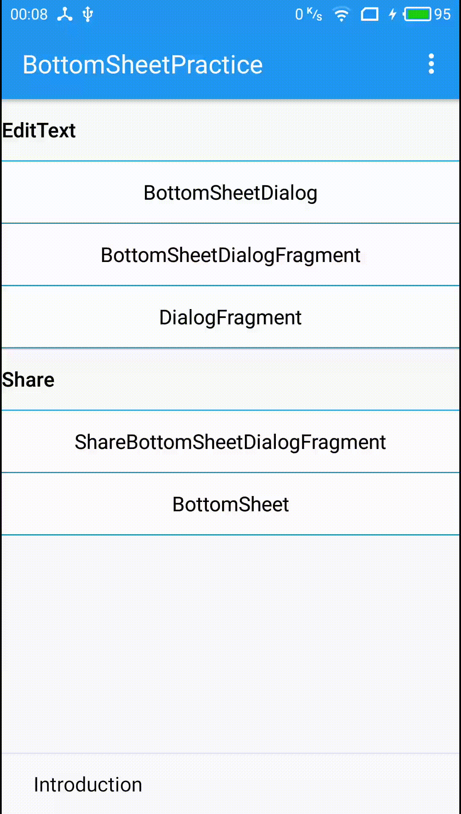

## BottomSheetPractice

I wrote an article to introduce Bottom Sheet.

* [Bottom Sheet 及相关知识](http://lijiankun24.com/Bottom-Sheet-%E5%8F%8A%E7%9B%B8%E5%85%B3%E7%9F%A5%E8%AF%86/)

Scan below QR code to download the apk.

    

### BottomSheetBehavior

    

### BottomSheetDialog

    

### BottomSheetDialogFragment

    

### DialogFragment

    

